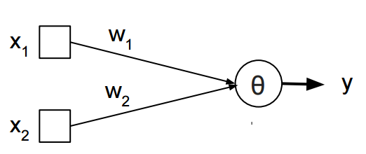
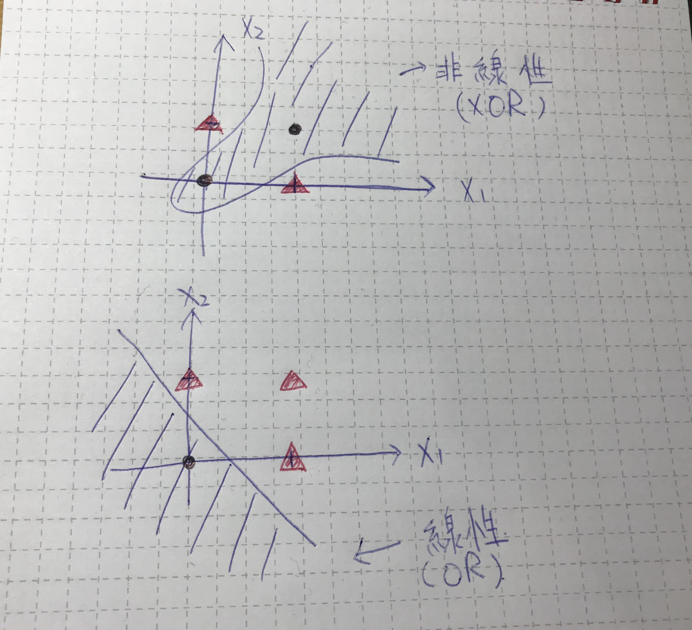
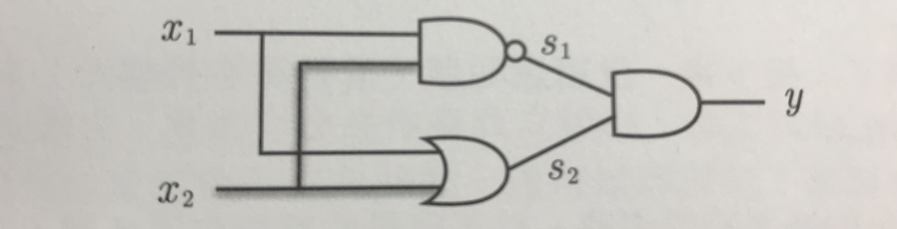
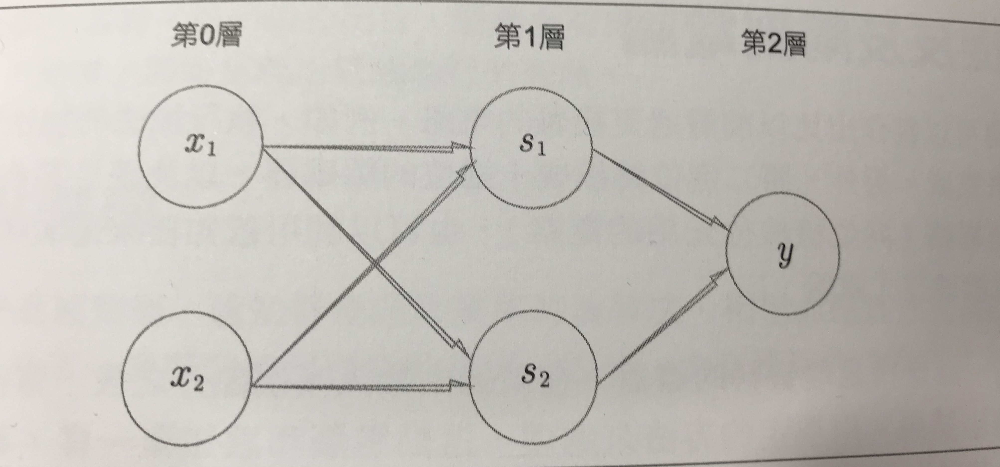
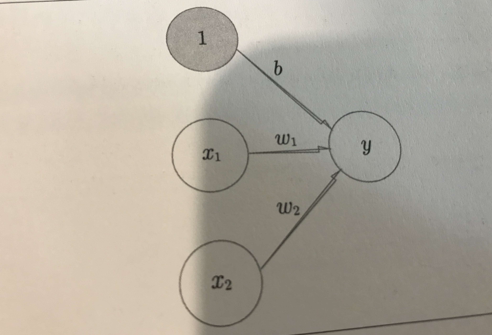
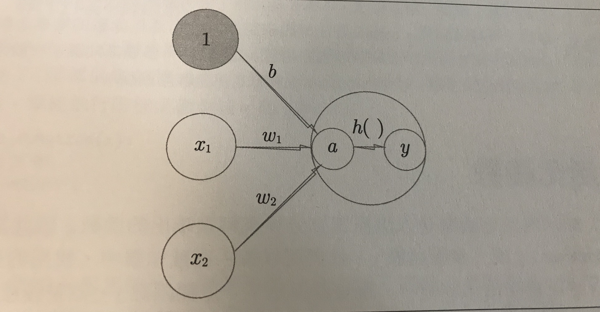
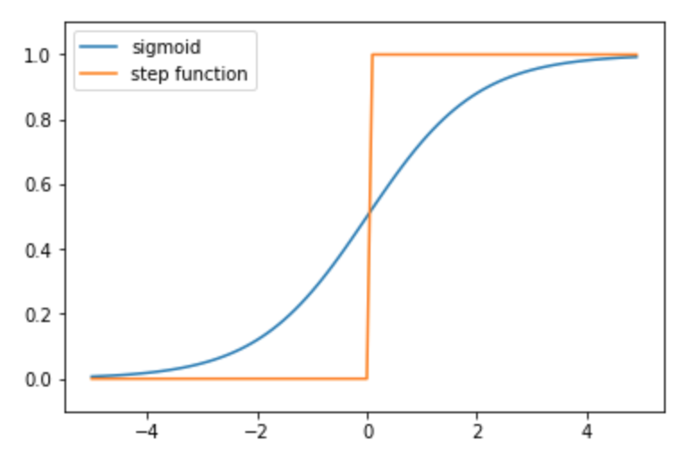
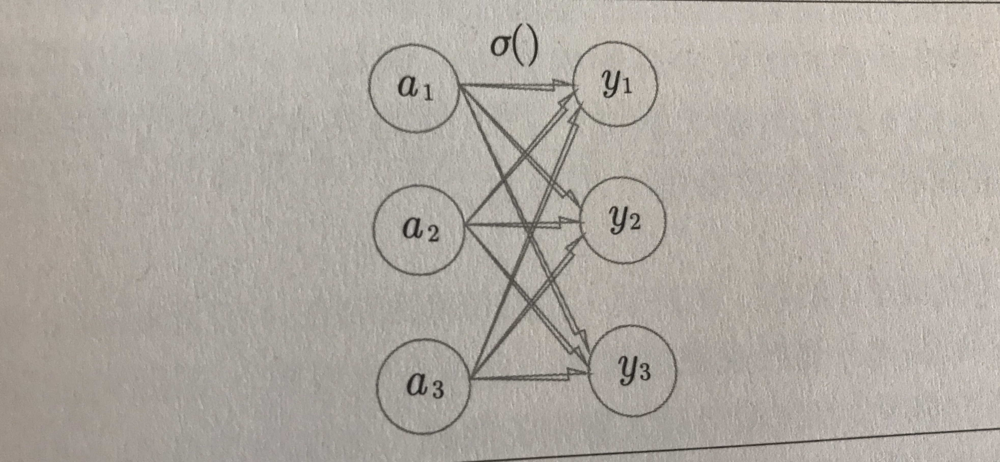

footer: © Unsigned Integer UG, 2017
slidenumbers: true

# Ch2
# Perceptron

- 一個有輸入輸出的演算法
- 控制weight、bias控制輸出
- 用perceptron實作一個And邏輯閘
- 拼裝一個NOR邏輯閘 -> 感知器是可以堆疊的
- Limit of percepton

---
## What is Perceptron ?

- 一個有輸入輸出的演算法


寫成算式：
$$
\mathcal{y} =
\begin{cases}
    0 & \text{$(w1x1 + w2x2 \leq \theta) $ } \\
    1 & \text{$(w1x1+w2x2 > \theta)$}
  \end{cases}
$$

寫成code:

```python
def perceptron(x1,x2):
	y = w1x1 + w2x2
	if y > θ:
		return 1 #(又叫'發火')
	else:
		return 0
```

---
## 用Perceptron實作一個AND邏輯閘
- 目標 1: 調整上方算式中 w1, w2, θ 的值使滿足下方 `AND`邏輯閘真值表

  |  x1  |  x2  |  y   |
  | :--: | :--: | :--: |
  |  0   |  0   |  0   |
  |  0   |  1   |  0   |
  |  1   |  0   |  0   |
  |  1   |  1   |  1   |

  - __答案__有無限多種 (x1, x2, θ) = (1, 1, 1), (0.5, 0.5, 0.8)...都能滿足條件


- 目標 2: 調整上方算式中 w1, w2, θ 的值使滿足下方 `OR`邏輯閘真值表

  |  x1  |  x2  |  y   |
  | :--: | :--: | :--: |
  |  0   |  0   |  0   |
  |  0   |  1   |  1   |
  |  1   |  0   |  1   |
  |  1   |  1   |  1   |
  - 答案依然有無限多種，(x1, x2, θ) = (1, 1, 0), (0.5, 0,5, 0.4) ...

---
## 加入Bias (偏權值)
我們將perceptron的算式改為，令b稱為偏權值：
$$
\mathcal{y} =
\begin{cases}
    0 & \text{$(b+w1x1 + w2x2 \leq 0) $ } \\
    1 & \text{$(b+w1x1+w2x2 > 0)$}
  \end{cases}
$$
b的共用是控制`發火`的難易度，與w1,w2的功用不同。

---

## 感知器極限

Q: 如何調整 w1, w2, b 完成 `XOR`邏輯閘

XOR Truth table:

|  x1  |  x2  |  y   |
| :--: | :--: | :--: |
|  0   |  0   |  0   |
|  0   |  1   |  1   |
|  1   |  0   |  1   |
|  1   |  1   |  0   |

A: 不論如何調整這三個變數都無法得到符合`XOR`邏輯閘的結果

在找尋合適辨識的過程中，其實是在找一條能夠分開output 為 0, 1結果的分隔線

以下圖所示，XOR需要一條非線性的線條才能夠區分兩種結果



---

## 如何Build出`XOR`邏輯閘？

### 多層感知器

感知器可以__疊層__

- 組合單一邏輯閘建立`XOR`:
  - 我們發現感知器是可以堆疊的，使用`AND`,`NAND`,`OR`就能組合成XOR

     

|  x1  |  x2  |  s1  |  s2  |  y   |
| :--: | :--: | :--: | :--: | :--: |
|  0   |  0   |  1   |  0   |  0   |
|  1   |  0   |  1   |  1   |  1   |
|  0   |  1   |  1   |  1   |  1   |
|  1   |  1   |  0   |  1   |  0   |


XOR的感知器圖如下



---
# Ch3 Neural Network

---
上一章提到的感知器我們的步驟是

1. 先訂出真值表

2. 跳整weight與bias使感知器表現符合真值表

在先前的過程中我們必須要人工的挑整參數，而神經網路的目的就是要讓電腦能由資料自動停整出適當的權重。

- 複習先前的感知器

  

算式：
$$
\mathcal{y} =
\begin{cases}
    0 & \text{$(b+w1x1 + w2x2 \leq 0) $ } \\
    1 & \text{$(b+w1x1+w2x2 > 0)$}
  \end{cases}
$$

- Activate Function $$ h(a) $$:

  

  算式：
  $$
  a = b + w1x1 + w2w2 \\
  y = h(a)
  $$

  ## Activate Function

  __作用：1.調整傳遞給下一層的訊號 2.設計輸出層的表現__:

  加入Activate Function後的的式子所輸出的結果y，將會是把感知器運算後的結果輸入到h(x)得到的結果。

  ---

  ## 有哪些Activate Function？

  1. sigmoid function:
     $$
     sigmoid(x) =  {1 \over  1+ \exp(-x)}
     $$
     

     Sigmoid的特性：

     - 輸出是連續的實數，相較於之前感知器定義的Step Function 有更多的輸出可能，這種平滑度較高的函數對於學習神經網路時有重要的意義。

     程式碼：

     ```python
     import numpy as np
     import matplotlib.pyplot as plt
     
     def sigmoid(x):
         return 1/(1+np.exp(-x))
     
     def step_function(x):
         return np.array(x>0, dtype=int)
     
     x = np.arange(-5, 5 , 0.1)
     y = sigmoid(x)
     plt.ylim(-0.1, 1.1)
     plt.plot(x, y)
     
     y2 = step_function(x)
     plt.plot(x, y2)
     plt.legend(['sigmoid','step function'])
     ```

     

  2. Softmax Function:

     用於分類問題的Activate Function

     算式：
     $$
     y_k = {\exp(a_k) \over \sum\limits_{i=1}^n \exp(a_i)}
     $$
     

  - Softmax 的特色是所有output為 0.0 ~1.0 的實數的且總和 = 1

  - 可以表現機率的概念，用在分類問題可以理解成有多少機率屬於某個分類

  - __[改良]__在計算時為了預防溢位通常會把所有輸入訊號減去樹入訊號中最大的值後在運算。

    - 算式推導：
      $$
      y_k = {\exp(a_k) \over \sum\limits_{i=1}^n \exp(a_i)} = C {\exp(a_k) \over \sum\limits_{i=1}^n \exp(a_i)} \\
      = {\exp(a_k + log(C)) \over \sum\limits_{i=1}^n \exp(a_i + log(C))} \\
      =  {\exp(a_k+ C') \over \sum\limits_{i=1}^n \exp(a_i + C')}
      $$
      

- 矩陣的相乘

- 手寫數字圖片MINIST的推論